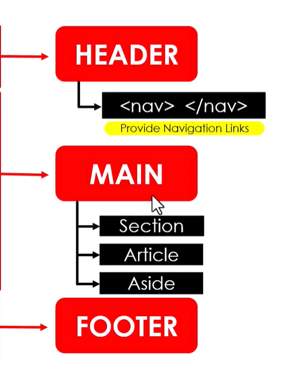

# Web Page Structure

## Overview
A web page is divided into **three main parts**:
- Header
- Main
- Footer

---

## 1. Header

- Top section of the webpage  
- Contains branding and navigation  

### Includes:
- Logo / Title  
- Navigation menu  

### HTML Tags:
```html
<header>
  <nav>
    <!-- Navigation Links -->
  </nav>
</header>

## 2. Main

The central and most important part of the webpage.

Contains actual content.

---

### Includes:

#### 🔹 Section
- Groups related content

#### 🔹 Article
- Independent content (blog, post, news)

#### 🔹 Aside
- Side content (links, ads, extra info)

---

### HTML Structure

```html
<main>
  <section>
    <article>
      Content goes here
    </article>
  </section>

  <aside>
    Sidebar content
  </aside>
</main>


<body>
  <header></header>
 
  <main></main>
  
  <footer></footer>
</body>

# Website Layout & Structure

## Definition
Website layout is the arrangement of elements on a webpage to improve user experience (UX) and user interface (UI).

---

## Purpose
- Organize content
- Improve readability
- Enable easy navigation
- Enhance user experience
- Support mobile-friendly design

---

## Basic Structure
- Header
- Navbar
- Main Content
- Sidebar (optional)
- Footer

---

## Content Hierarchy
1. Headings (H1, H2)
2. Subheadings
3. Body text
4. Images / media

> Helps users scan content quickly and improves clarity.

---

## Types of Layouts

### Fixed Layout
- Uses fixed width (e.g., 1200px)

**Pros:**
- Simple to design
- Consistent layout

**Cons:**
- Not responsive
- Poor on small screens

---

### Fluid (Liquid) Layout
- Uses percentage (%) width

**Pros:**
- Flexible across screens
- Uses available space

**Cons:**
- Can stretch too much
- Less design control

---

### Responsive Layout
- Adapts to all screen sizes

**Pros:**
- Mobile-friendly
- Best user experience
- SEO-friendly

**Cons:**
- More complex to build
- Requires testing

---

## Layout Techniques

### Flexbox
- One-dimensional (row or column)

**Pros:**
- Easy alignment
- Flexible

**Cons:**
- Limited for complex layouts

---

### CSS Grid
- Two-dimensional (rows and columns)

**Pros:**
- Powerful and structured
- Great for complex layouts

**Cons:**
- Slightly harder to learn

---

## Responsive Design
- Works on mobile, tablet, and desktop
- Uses media queries and flexible layouts

> Goal: One website for all devices

---

## Importance

**Advantages:**
- Better user experience
- Easy navigation
- Professional look

**Disadvantages (poor layout):**
- Confusing design
- High bounce rate
- Bad user experience

---

## Best Practices
- Keep layout simple
- Use whitespace effectively
- Maintain consistency
- Design for responsiveness
- Focus on readability

---

## Summary
- Layout = structure of a webpage
- Main parts: Header, Navbar, Main, Sidebar, Footer
- Best approach: Responsive design
- Use Flexbox for simple layouts and Grid for complex layouts