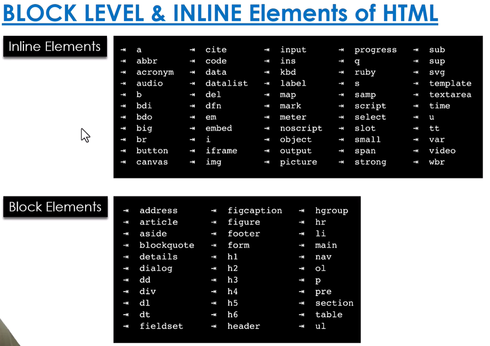

# 📌 Block vs Inline Elements

HTML elements are mainly divided into **Block-level elements** and **Inline elements** based on how they behave on a webpage.

---

## 🔷 Block-level Elements

Block elements take up the **full width** and always start on a **new line**.

### ✅ Characteristics
- Starts on a **new line**  
- Takes **full width available**  
- Can contain **block and inline elements**  

### 💻 Examples
```html
<div>Block Element</div>
<p>Paragraph</p>
<h1>Heading</h1>

## ⚖️ Difference Table

| Feature     | Block Element                  | Inline Element                |
|------------|-------------------------------|------------------------------|
| Line Break | Starts on new line            | Stays in same line           |
| Width      | Full width                    | Only required width          |
| Content    | Can contain block & inline    | Usually text or inline only  |
| Example    | `<div>`, `<p>`, `<h1>`        | `<span>`, `<a>`, `<strong>`  |


    

# 📌 Understanding the `<div>` Element

The `<div>` is a **generic container** for flow content.  
Think of it as a **plain, invisible box** used to group other HTML elements together so they can be managed as a single unit.

---

## 🔑 Key Characteristics

### 1. Block-level Element
- By default, a `<div>` starts on a **new line**.  
- It takes up the **full width available** (stretches left and right as much as possible).  

---

### 2. Non-Semantic
- Unlike elements like `<header>` or `<footer>`, a `<div>` has **no specific meaning**.  
- It is a **pure container** used mainly for grouping elements.  

---

### 3. The CSS Connection
- A `<div>` does **nothing visually by default**.  
- It becomes useful when styled with **CSS**.  

Developers use:
- `class`  
- `id`  

to apply styles like:
- background colors  
- borders  
- margins  
- layouts  

---

## 💻 Example

```html
<div class="container">
  <h1>Welcome</h1>
  <p>This is inside a div.</p>
</div>


# 📌 Understanding the `<span>` Element

The `<span>` is a **generic inline container** used to group small parts of text or elements for styling and manipulation.

Think of it as a **small invisible wrapper** used inside text.

---

## 🔑 Key Characteristics

### 1. Inline Element
- `<span>` does **NOT start on a new line**.  
- It only takes up as much width as needed.  
- Used **inside text or other elements**.  

---

### 2. Non-Semantic
- `<span>` has **no specific meaning**.  
- It is used purely for **styling or grouping small content**.  

---

### 3. The CSS Connection
- `<span>` does **nothing visually by default**.  
- It becomes useful when styled using **CSS**.  

Developers use:
- `class`  
- `id`  

to apply styles like:
- color  
- font-weight  
- background  
- text styling  

---

## 💻 Example

```html
<p>This is a <span class="highlight">important</span> word.</p>