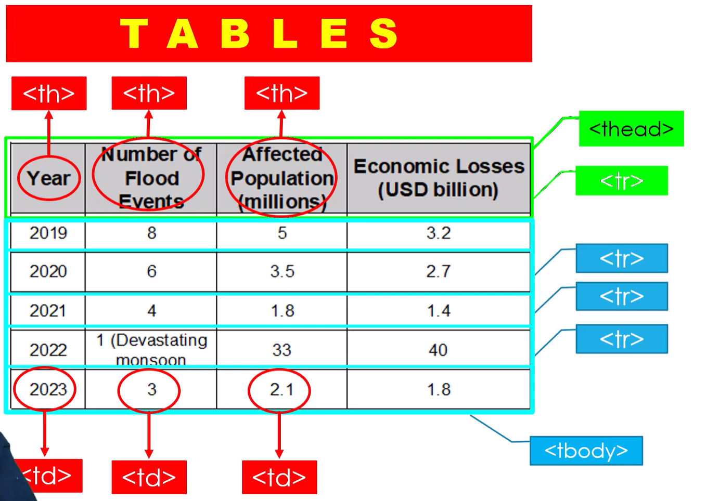
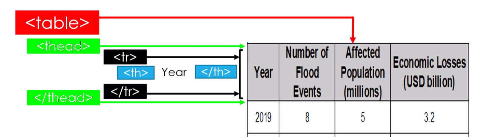
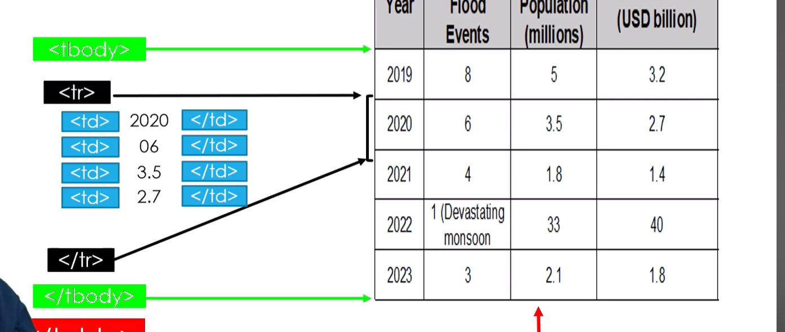

# 📌 HTML Tables

Tables are used to **organize data in rows and columns** on a webpage.  

---

## 🔷 Basic Table Tags

| Tag      | Description                                  |
|---------|---------------------------------------------|
| `<table>` | Defines a table container                  |
| `<tr>`    | Table row                                 |
| `<th>`    | Table header cell (bold and centered)     |
| `<td>`    | Table data cell                           |
| `<caption>` | Table title or caption (optional)       |
| `<thead>` | Groups header rows (optional)            |
| `<tbody>` | Groups body rows (optional)              |
| `<tfoot>` | Groups footer rows (optional)            |

---






## 💻 Basic Example

```html
<table border="1">
  <caption>Student Scores</caption>
  <tr>
    <th>Name</th>
    <th>Subject</th>
    <th>Marks</th>
  </tr>
  <tr>
    <td>Ali</td>
    <td>Math</td>
    <td>95</td>
  </tr>
  <tr>
    <td>Sara</td>
    <td>Science</td>
    <td>88</td>
  </tr>
</table>