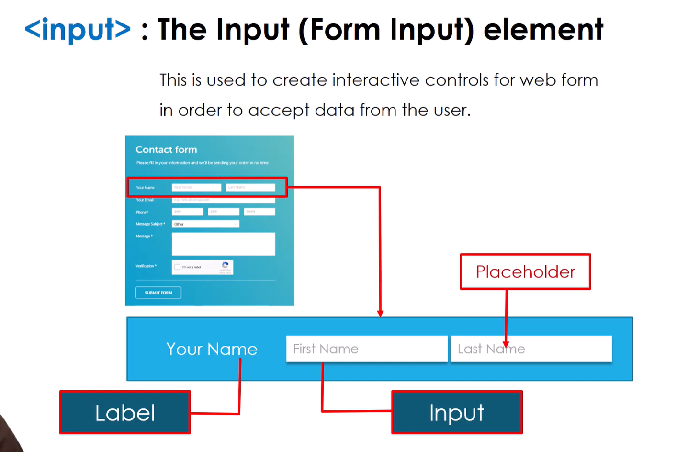

# 📌 HTML Forms

Forms are used to **collect user input** on web pages.  
They provide fields like text boxes, checkboxes, radio buttons, and submit buttons.

---

## 🔷 Main Form Tag

| Tag       | Description                                    |
|----------|-----------------------------------------------|
| `<form>`  | Defines the form container                     |
| `action`  | URL where form data is sent                    |
| `method`  | HTTP method (`GET` or `POST`)                 |

---

## 🔷 Common Form Elements

| Element      | Description                              | Example HTML |
|-------------|------------------------------------------|-------------|
| `<input>`    | Single-line input field                  | `<input type="text" name="username">` |
| `<textarea>` | Multi-line text area                      | `<textarea name="message"></textarea>` |
| `<button>`   | Button element (submit, reset, or custom)| `<button type="submit">Send</button>` |
| `<select>`   | Drop-down list                           | `<select name="gender"><option>Male</option><option>Female</option></select>` |
| `<option>`   | Option inside `<select>`                 | See above   |
| `<label>`    | Label for form element                   | `<label for="username">Username:</label>` |
| `<fieldset>` | Groups related form elements             | `<fieldset>...</fieldset>` |
| `<legend>`   | Caption for `<fieldset>`                 | `<legend>Personal Info</legend>` |

---

## 💻 Example Form

```html
<form action="/submit" method="post">
  <label for="name">Name:</label>
  <input type="text" id="name" name="name"><br><br>

  <label for="email">Email:</label>
  <input type="email" id="email" name="email"><br><br>

  <label for="message">Message:</label>
  <textarea id="message" name="message"></textarea><br><br>

  <input type="submit" value="Send">
</form>

